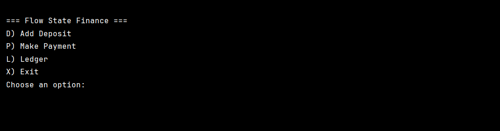
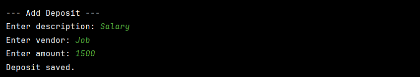
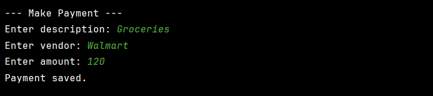
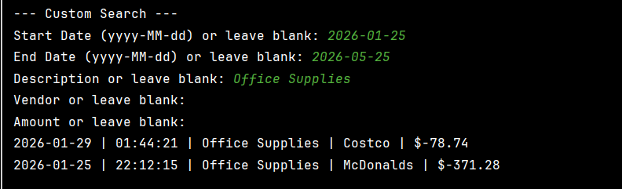

# Flow State Finance

## 📌 Project Description
Flow State Finance is a command-line Java application that allows users to track financial transactions for personal or business use. The application records deposits and payments, stores them in a CSV file, and provides tools to view and analyze financial activity through a ledger and reports system.

Each transaction includes:
- Date
- Time
- Description
- Vendor
- Amount

All data is saved in a file named `transactions.csv`.

---

## ⚙️ Features

### Home Screen
- Add Deposit
- Make Payment (Debit)
- View Ledger
- Exit Application

### Ledger Screen
- View All Transactions (newest first)
- View Deposits only
- View Payments only
- Access Reports

### Reports Screen
- Month To Date
- Previous Month
- Year To Date
- Previous Year
- Search by Vendor
- Custom Search:
  - Start Date
  - End Date
  - Description
  - Vendor
  - Amount

---
## 📂 File Structure

src/

FlowStateFinanceApp.java

Transaction.java

TransactionFileManager.java

transactions.csv
# transactions.csv

## 🧠 How It Works
- Transactions are created using user input.
- Each transaction is saved as a line in `transactions.csv`.
- The ledger reads from the file and displays entries.
- Reports filter transactions based on date ranges or search criteria.

---

## 📝 Notes
- Deposits are stored as positive values.
- Payments are stored as negative values.
- Data persists between runs using the CSV file.

---

# 📷 Pictures
### Home Screen

### Adding a Deposit

### Adding a Payment

### Ledger Screen

### Reports Screen

### Custom Search 
